# Implementations

## Functions
Contents\
├── [_data](#_data)\
├── [_model](#_model)\
├── [demo](#demo)\
└── [src](#src)

### _data
This is a folder containing prerecorded data for calculations and generated data from functions.

### _model
#### SystemModel_GeneralLCC[.m](https://github.com/soc-ucsd/LCC/blob/main/src/SystemModel_GeneralLCC.m) / [.py](https://github.com/soc-ucsd/LCC/blob/main/Python%20Implementation/src/SystemModel_GeneralLCC.py)
The purpose of this function is linearized state-space model for general LCC system

**Input:**
- N: number of the following HDVs
- M: number of the preceding HDVs
- alpha1, alpha2, alpha3: parameters from the linearized car-following model

**Output:**
- A, B: system matrices

**General System Model Formula:**

$$\dot{x}(t)=Ax(t)+Bu(t)+H\tilde{v}_{\mathrm{h}}(t)$$

where $\tilde{v}_{\mathrm{h}}(t)$ denotes the velocity error of the head vehicle. The coefficient matrices $A\in \mathbb{R}^{(2n+2m+2)\times(2n+2m+2)}$, $B,H\in \mathbb{R}^{(2n+2m+2)\times 1}$ are given by 

$$
A =
\begin{bmatrix} 
P_1 & & & & & \\
P_2 & P_1 & & & & \\
& \ddots & \ddots & & & \\
& & P_2 & P_1 & & \\
& & & S_2 & S_1 \\
& & & & P_2 & P_1 \\
& & & & & \ddots & \ddots \\
& & & & & & P_2 & P_1 
\end{bmatrix},
$$

$$
B = 
\lbrack
b_{-m}^{T},\ldots,b_{-1}^{T},b_0^{T},b_1^{T},\ldots,b_n^{T}
\rbrack^{T},
$$

$$
H = 
\lbrack
h_{-m}^{T},\ldots,h_{-1}^{T},h_0^{T},h_1^{T},\ldots,h_n^{T}
\rbrack^{T},
$$

with block entries as ($i\in \mathcal{F}\cup \mathcal{P}$, $j\in \{0\}\cup\mathcal{F}\cup \mathcal{P} \backslash \{-m\}$)

$$
P_{1} = 
\begin{bmatrix} 0 & -1 \\ 
\alpha_{1} & -\alpha_{2} 
\end{bmatrix},
P_{2} = 
\begin{bmatrix} 0 & 1 \\ 
0 & \alpha_{3} 
\end{bmatrix},\,
b_0 = 
\begin{bmatrix} 0  \\ 
1 
\end{bmatrix},
b_i = 
\begin{bmatrix} 0 \\ 
0 
\end{bmatrix},\\
$$

$$
S_1 = 
\begin{bmatrix} 0 & -1 \\
0 & 0 
\end{bmatrix},
S_2 = 
\begin{bmatrix} 0 & 1 \\
 0 & 0 
 \end{bmatrix},
h_{-m} = 
\begin{bmatrix} 1 \\
\alpha_{3}
\end{bmatrix},
h_j = 
\begin{bmatrix} 0 \\
0 
\end{bmatrix}.
$$

$\mathcal{F}$ is defined as $\{1,2,...,n\}$ and $\mathcal{P}$ is defined as $\{-1,-2,...,-m\}$ shown in LCC figure

#### SystemModel_CF[.m](https://github.com/soc-ucsd/LCC/blob/main/_model/SystemModel_CF.m) / [.py](https://github.com/soc-ucsd/LCC/blob/main/Python%20Implementation/_model/SystemModel_CF.py)
The purpose of this function is linearized state-space model for Car-following system

**Input:**
- N: the number of vehicles in FD-LCC
- alpha1, alpha2, alpha3: parameters from the linearized car-following model

**Output:**
- state-space model: [A, B]
$\dot{x} = Ax + Bu$

**Car-following system model formula:**
$\dot{x}\_{\mathrm{c}}(t)=A\_{\mathrm{c}}x\_\mathrm{c}(t)+B\_1 \hat{u}(t)+H\_1 \tilde{v}\_{\mathrm{h}}(t)$
where $A_{\mathrm{c}}\in \mathbb{R}^{(2n+2)\times(2n+2)}$, $B_1,H_1\in \mathbb{R}^{(2n+2)\times 1}$ are given by

$$
A_{\mathrm{c}}=
\begin{bmatrix} P_1 & & & \\
P_2 & P_1 & &    \\
& \ddots& \ddots&  \\
& & P_2& P_1 \\
\end{bmatrix}
B_1=
\begin{bmatrix}
0\\
1\\
0\\ 
\vdots \\
0
\end{bmatrix},
H_1=
\begin{bmatrix}
1\\
\alpha_3 \\
0\\
\vdots \\
0
\end{bmatrix}.
$$

> (For more information of how to derive from general formula to car-following formula, please check the [LCC paper](https://arxiv.org/abs/2012.04313))

#### SystemModel_FD[.m](https://github.com/soc-ucsd/LCC/blob/main/_model/SystemModel_FD.m) / [.py](https://github.com/soc-ucsd/LCC/blob/main/Python%20Implementation/_model/SystemModel_FD.py)
The purpose of this function is linearized state-space model for free-driving system

**Input:**
- N: the number of vehicles in FD-LCC
- alpha1, alpha2, alpha3: parameters from the linearized free-driving model

**Output:**
- state-space model: [A, B]
$\dot{x} = Ax + Bu$

**Free-driving system model formula:**
$\dot{x}\_{\mathrm{f}}(t)=A\_{\mathrm{f}}x\_\mathrm{f}(t)+B\_1 u(t),$ where $A_{\mathrm{f}}\in \mathbb{R}^{(2n+2)\times(2n+2)}$ is given by

$$
A_{\mathrm{f}}=
\begin{bmatrix} S_1 & & & \\
P_2 & P_1 & &    \\
& \ddots& \ddots&  \\
& & P_2& P_1 \\
\end{bmatrix}.
$$

>(For more information of how to derive from general formula to free-driving formula, please check the [LCC paper](https://arxiv.org/abs/2012.04313))

### demo
#### free_driving_LCC[.m](https://github.com/soc-ucsd/LCC/blob/main/demo/free_driving_LCC.m) / [.py](https://github.com/soc-ucsd/LCC/blob/main/Python%20Implementation/demo/free_driving_LCC.py)
This is one of the major function that generates a simulation for a scenario. The generated graphs are shown [here](https://soc-ucsd.github.io/LCC/#/README).
There are two cases:
1. Car-Driving LCC
2. Free-Driving LCC

This can be toggled by changing the parameter `FD_bool = 0`. 0 is CF-LCC and 1 is FD-LCC.
Upon finishing calculation for the simulation, the code also prints out a comparision of the average abosulte velocity error and the fuel consumption between **no CAV** and **LCC**.
- **Car-Driving LCC** Average abosulte velocity error:

|Looking ahead only (all HDVs)  |   LCC       |  Improvement rate|
| ----------------------------- | ----------- | ---------------- |
|0.89                           |  0.81       |  0.0896          |
- **Car-Driving LCC** Total fuel consumption:

|Looking ahead only (all HDVs)  |   LCC       |  Improvement rate|
| ----------------------------- | ----------- | ---------------- |
|392.84                         |  340.57     |  0.1331          |
- **Free-Driving LCC** Average abosulte velocity error:

|Looking ahead only (all HDVs)  |   LCC       |  Improvement rate|
| ----------------------------- | ----------- | ---------------- |
|0.89                           |  0.58       |  0.3497          |
- **Free-Driving LCC** Total fuel consumption:

|Looking ahead only (all HDVs)  |   LCC       |  Improvement rate|
| ----------------------------- | ----------- | ---------------- |
|392.84                         |  321.94     |  0.1805          |

#### car_following_LCC[.m](https://github.com/soc-ucsd/LCC/blob/main/demo/car_following_LCC.m)
This function serves the same purpose as **free_driving_LCC**[.m](https://github.com/soc-ucsd/LCC/blob/main/demo/free_driving_LCC.m) / [.py](https://github.com/soc-ucsd/LCC/blob/main/Python%20Implementation/demo/free_driving_LCC.py).

### src
#### ControEngergy[.m](https://github.com/soc-ucsd/LCC/blob/main/src/ControlEnergy.m) / [.py](https://github.com/soc-ucsd/LCC/blob/main/Python%20Implementation/src/ControlEnergy.py)
The purpose of this file is numerically calculate the three energy-related metrics of the FD-LCC system at different system sizes and time lengths

For a controllable dynamical system $\dot{x}(t)=Ax(t)+Bu(t)$, its Controllability Gramian at time $t$ is defined as $W(t)=\int_{0}^{t} e^{A \tau} B B^{T} e^{A^{T} \tau} d \tau$, which is always positive definitive.

The minimum control energy required to move the system from the initial state $x(0)=x_0$ to the target state $x(t)=x_{\mathrm{tar}}$ is given by 
$$\min \int_{0}^{t} u(\tau)^{T} u(\tau) \, d\tau = \left(x_{\mathrm{tar}}-e^{A t} x_{0}\right)^{T} W\left(t\right)^{-1}\left(x_{\mathrm{tar}}-e^{A t} x_{0}\right)$$

This file will output 3 metrics:
- Metric 1: smallest eigenvalue of Controllability Gramian: $\lambda_{\mathrm{min}}(W(t))$, worst-case metric inversely related to the energy required to move the system in the direction that is the most difficult to move.
- Metric 2: trace of inverse Controllability Gramian: $\mathrm{Tr}(W(t)^{-1} )$, average control energy over random target states.
- Metric 3: minimum transfer energy: $E_{min}(t)$

**Default Parameters Setup:**
- FD_bool: mode of the LCC system 0. CF-LCC; 1. FD-LCC
- s_star = 20: Equilibrium spacing correspond to an equilibrium velocity of 15 m/s
- alpha = 0.6: default alpha value
- beta = 0.9: default beta value
- s_st = 5: small spacing threshold for velocity becomes to 0.
- s_go = 35: large spacing threshold for velocity reaches to maximum velocity
- v_max = 30: max velocity

**Output:**
The matrics is calculated on time length 10, 20, 30 and system size 1 to 6.

1. Free-Driving:
- Metric 1:

Example output from Python:             |  Example output from Matlab:
:--------------------------------------:|:-------------------------:
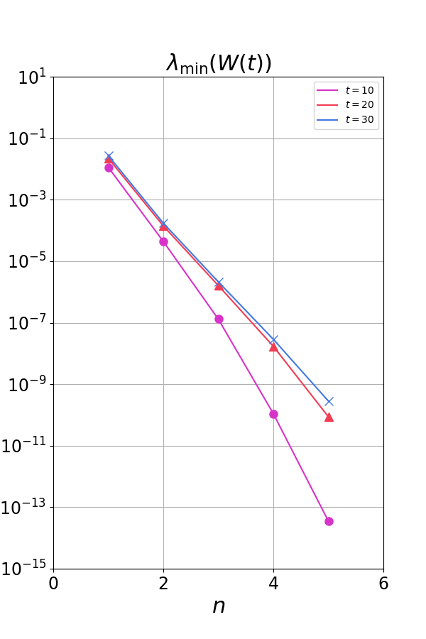|  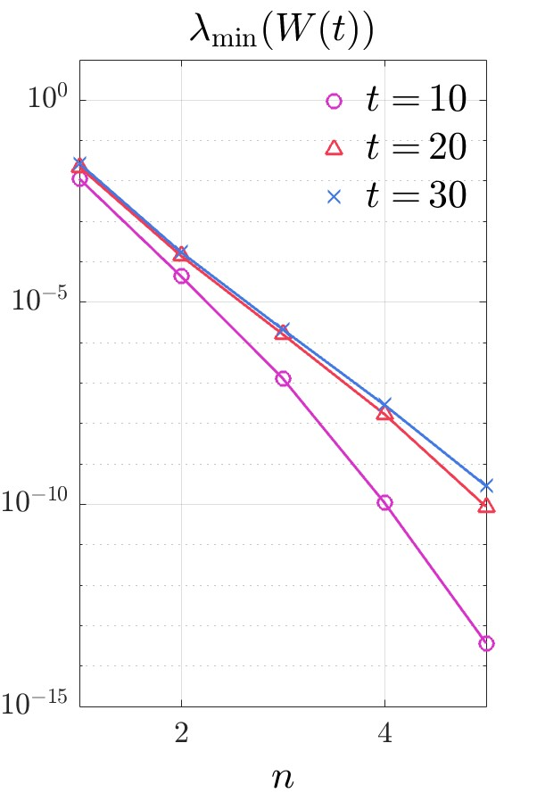

- Metric 2:
  
Example output from Python:             |  Example output from Matlab:
:--------------------------------------:|:-------------------------:
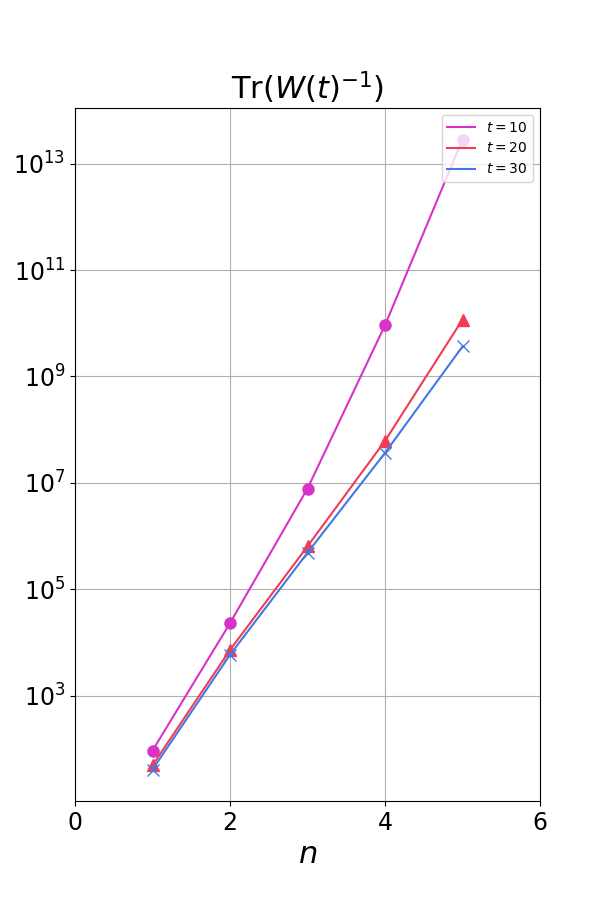|  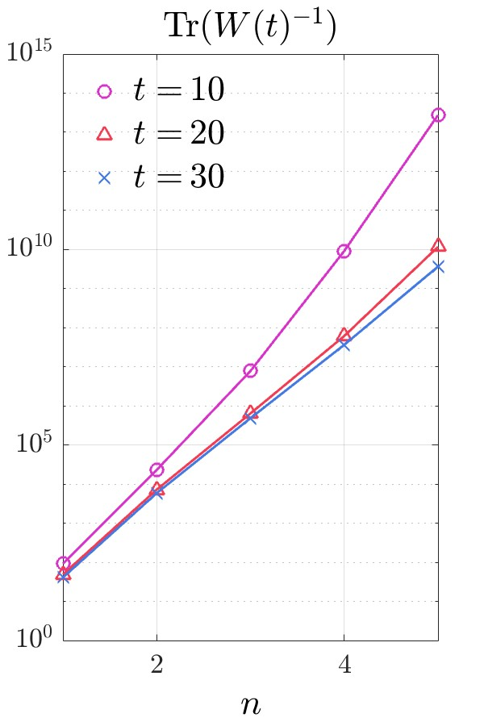

- Metric 3:

Example output from Python:             |  Example output from Matlab:
:--------------------------------------:|:-------------------------:
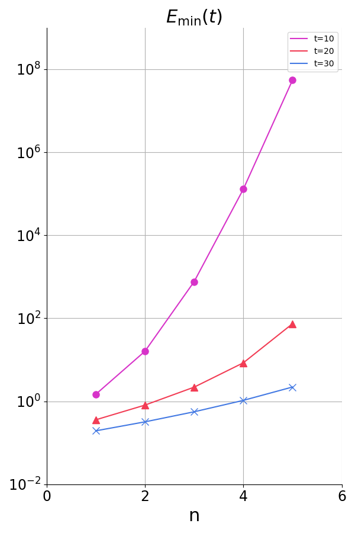|  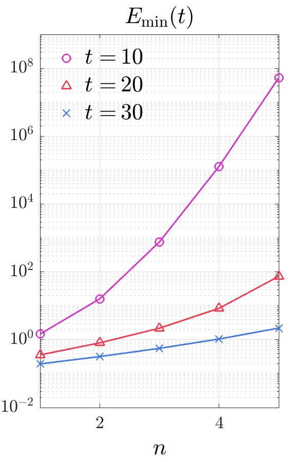

1. Car-Following:
- Metric 1:

Example output from Python:             |  Example output from Matlab:
:--------------------------------------:|:-------------------------:
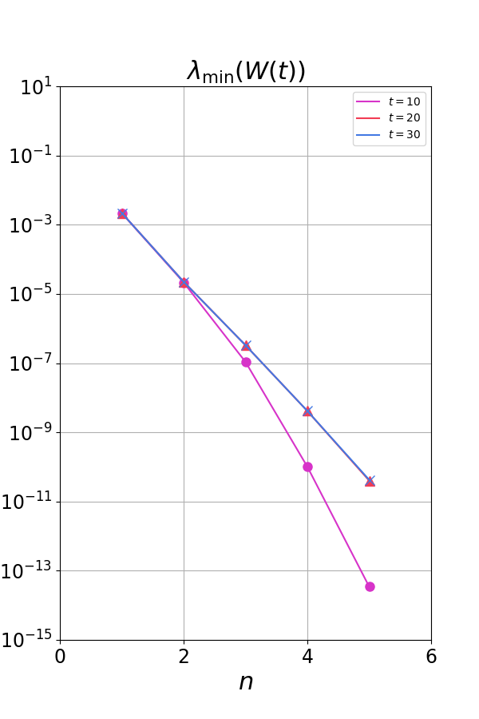|  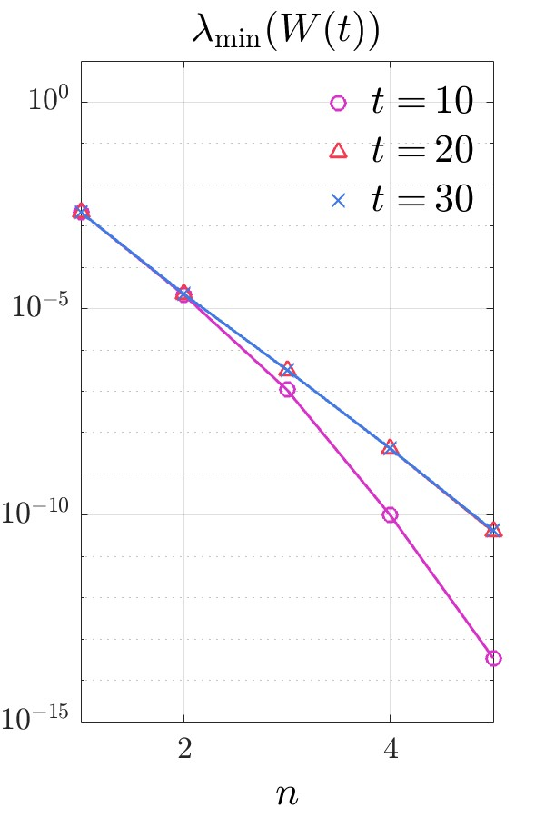

- Metric 2:

Example output from Python:             |  Example output from Matlab:
:--------------------------------------:|:-------------------------:
|  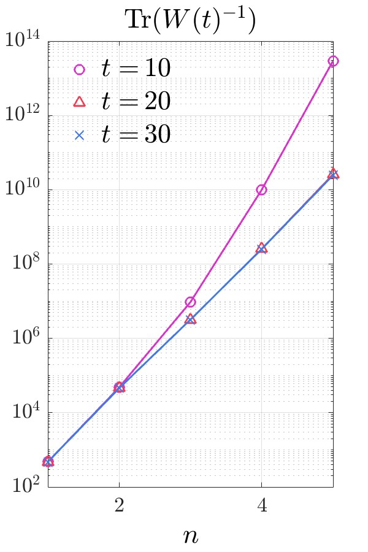

- Metric 3:
  
Example output from Python:             |  Example output from Matlab:
:--------------------------------------:|:-------------------------:
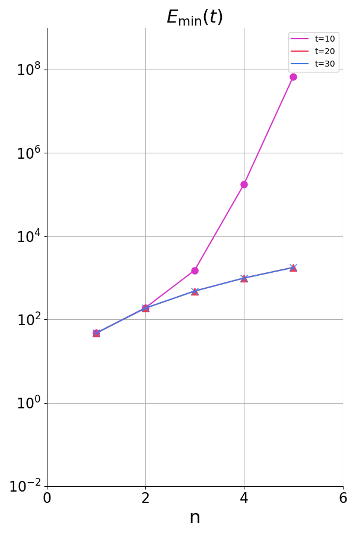|  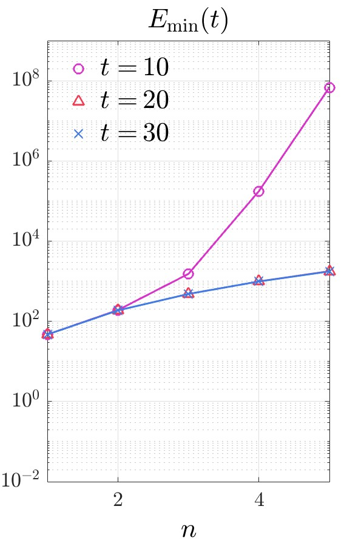

For the free-driving, the matlab code takes about 2.0199 seconds, the python code takes about 0.5155 seconds.

For the car-following, the matlab code takes about 1.8468 seconds, the python code takes about 0.4041 seconds.

The primary reason that matlab code takes longer than python code is because the progress bar in matlab code takes a lot of time. If we just delete the code for progress bar, it only takes about 0.2086 seconds to excute the code.

#### Find_NewLookingAheadStringStableRegion_AfterLookingBehind[.m](https://github.com/soc-ucsd/LCC/blob/main/src/Find_NewLookingAheadStringStableRegion_AfterLookingBehind.m) / [.py](https://github.com/soc-ucsd/LCC/blob/main/Python%20Implementation/src/Find_NewLookingAheadStringStableRegion_AfterLookingBehind.py)

The purpose of this file is to find the new "looking ahead" head-to-tail string stable regions after incorporating the motion of the vehicles behind 

**Default Parameters Setup:**
- n = 2: Number of the following HDVs
- m = 2: Number of the preceding HDVs
- mu_behind = -1: default mu value for the vehicle behind
- k_befind = -1: default k value for the vehicle behind
- s_star = 20: Equilibrium spacing correspond to an equilibrium velocity of 15 m/s
- alpha = 0.6: default alpha value
- beta = 0.9: default beta value
- s_st = 5: small spacing threshold for velocity becomes to 0.
- s_go = 35: large spacing threshold for velocity reaches to maximum velocity
- v_max = 30: max velocity

**Head-to-tail transfer function of the LCC system:**

We define 

$$\varphi  \left( s \right) = \alpha _{3}s+ \alpha _{1},  \gamma  \left( s \right) =s^{2}+ \alpha _{2}s+ \alpha _{1}$$

and $\mu\_{i}$, $k\_{i}$ as the static feedback gain of the spacing error and the velocity error of vehicle $i$  ($i \in \mathcal{F} \cup \mathcal{P}$), respectively. 

> For more information of how to derive $\varphi$ and $\gamma$, please check the [LCC paper](https://arxiv.org/abs/2012.04313) section IV.

We define the Head-to-tail Transfer Function as:

$$\Gamma (s) = \frac{\widetilde{V}\_\mathrm{t} (s)  }{\widetilde{V}\_\mathrm{h} (s) }$$

where $\widetilde{V}\_\mathrm{h}(s), \widetilde{V}\_\mathrm{t}(s)$ denote the Laplace transform of  $\tilde{v}\_\mathrm{h} (t)$  and  $\tilde{v}\_\mathrm{t} (t)$, respectively.

Head-to-tail transfer function for LCC is shown as following:

$$\Gamma  \left( s \right) =G(s) \cdot \left( \frac{ \varphi  \left( s \right) }{ \gamma  \left( s \right) } \right) ^{n+m},$$

where

$$G(s)=\frac{ \varphi  \left( s \right) + \sum\_{i\in \mathcal{P}}H_{i} \left( s \right)  ( \frac{ \varphi  \left( s \right) }{ \gamma  \left( s \right) } ) ^{i+1}}{ \gamma  \left( s \right) - \sum\_{i \in \mathcal{F}} H_{i} \left( s \right)  ( \frac{ \varphi  \left( s \right) }{ \gamma  \left( s \right) } ) ^{i}},$$

with

$$H\_{i} \left( s \right) = \mu\_{i}\left(\frac{\gamma (  s )}{\varphi  ( s )} - 1\right)+k\_{i}s,\,i \in \mathcal{F} \cup \mathcal{P}.$$

The system is called head-to-tail string stable if and only if 

$$|\Gamma(j \omega)|^2 < 1, \forall \omega > 0$$

where $j^2=-1$, and $| \cdot |$ denotes the modulus.

**Output:**

The code generates four .mat files, each storing all static variables and a string stability matrix related to specific parameters, id_ahead (preceding vehicle id) and id_behind (following vehicle id). In each matrix, entries are marked with a 1 for combinations of mu and k that yield string stability based on the given formula, and 0 otherwise. The files correspond to different configurations of id_ahead and id_behind: one for id_ahead = -1 and id_behind = 1, one for id_ahead = -1 and id_behind = 2, one for id_ahead = -2 and id_behind = 1, and one for id_ahead = -2 and id_behind = 2. Note that while mu and k for id_behind remain constant across calculations, they vary for id_ahead in each computation.

#### Find_PlantStableRegion_MonitoringOneHDV[.m](https://github.com/soc-ucsd/LCC/blob/main/src/Find_PlantStableRegion_MonitoringOneHDV.m) / [.py](https://github.com/soc-ucsd/LCC/blob/main/Python%20Implementation/src/Find_PlantStableRegion_MonitoringOneHDV.py)
The purpose of this file is to find the plant stable region when monitoring one HD

**Default Parameters Setup:**
- n = 2: Number of the following HDVs
- m = 2: Number of the preceding HDVs
- s_star = 20: Equilibrium spacing correspond to an equilibrium velocity of 15 m/s
- alpha = 0.6: default alpha value
- beta = 0.9: default beta value
- s_st = 5: small spacing threshold for velocity becomes to 0.
- s_go = 35: large spacing threshold for velocity reaches to maximum velocity
- v_max = 30: max velocity

**Output:**
The code generates four .mat files, each storing all static variables and a string stability matrix related to specific id parameters. In each matrix, entries are marked with a 1 if it's plant stable, and 0 otherwise. The files correspond to different configurations of vehicle id: -2, -1, 1, and 1.

#### Find_StringStableRegion_MonitoringOneHDV

The purpose of this file is to find the head-to-tail string stable regions when monitoring one HDV. 

**Default Parameters Setup:**
- n = 2: Number of the following HDVs
- m = 2: Number of the preceding HDVs
- s_star = 20: Equilibrium spacing correspond to an equilibrium velocity of 15 m/s
- alpha = 0.6: default alpha value
- beta = 0.9: default beta value
- s_st = 5: small spacing threshold for velocity becomes to 0.
- s_go = 35: large spacing threshold for velocity reaches to maximum velocity
- v_max = 30: max velocity

**Head-to-tail transfer function of the LCC system that only monitoring one HDV:**

When only monitoring one HDV the transfer function is slightly different for each different cases.

Case 1: id < 0 Monitoring the preceding vehicle

$$\Gamma  \left( s \right) =\frac{ \varphi  \left( s \right) + \sum\_{i\in \mathcal{P}}H_{i} \left( s \right)  ( \frac{ \varphi  \left( s \right) }{ \gamma  \left( s \right) } ) ^{i+1}}{ \gamma  \left( s \right)} \cdot \left( \frac{ \varphi  \left( s \right) }{ \gamma  \left( s \right) } \right) ^{n+m}$$

Case 2: id > 0 Monitoring the following vehicle

$$\Gamma  \left( s \right) =\frac{ \varphi  \left( s \right)  }{ \gamma  \left( s \right)- \sum\_{i \in \mathcal{F}} H\_{i} \left( s \right)  ( \frac{ \varphi  \left( s \right) }{ \gamma  \left( s \right) } ) ^{i}} \cdot \left( \frac{ \varphi  \left( s \right) }{ \gamma  \left( s \right) } \right) ^{n+m}$$

Besides the Gamma function formula, the rest formula stays the same.

**Output:**
The code generates four .mat files, each storing all static variables and a string stability matrix related to specific id parameters. In each matrix, entries are marked with a 1 for combinations of mu and k that yield string stability based on the given formula, and 0 otherwise. The files correspond to different configurations of vehicle id: -2, -1, 1, and 1.

#### Plot_StringStableRegion_MonitoringOneHDV[.m](https://github.com/soc-ucsd/LCC/blob/main/src/Plot_StringStableRegion_MonitoringOneHDV.m) / [.py](https://github.com/soc-ucsd/LCC/blob/main/Python%20Implementation/src/Plot_StringStableRegion_MonitoringOneHDV.py)
The purpose of this file is giving a visualization of string stable region for each different vehicle.

**Input:**
- id = -2: vehicle id that want to plot into the graph
- n = 2: Number of the following HDVs
- m = 2: Number of the preceding HDVs

**Output:**
- Vehicle id -2

Example output from Python:             |  Example output from Matlab:
:--------------------------------------:|:-------------------------:
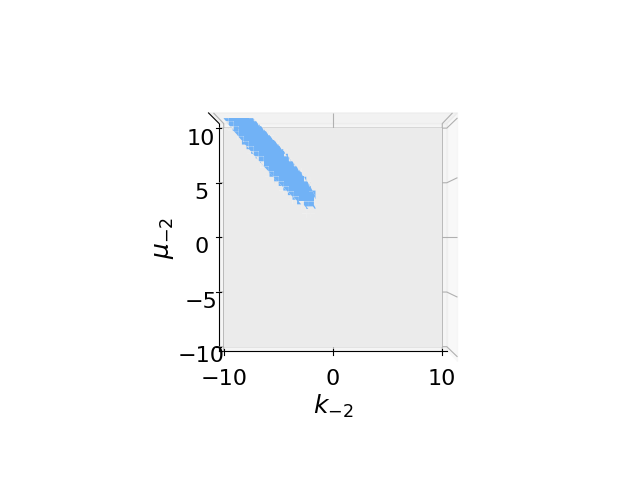|  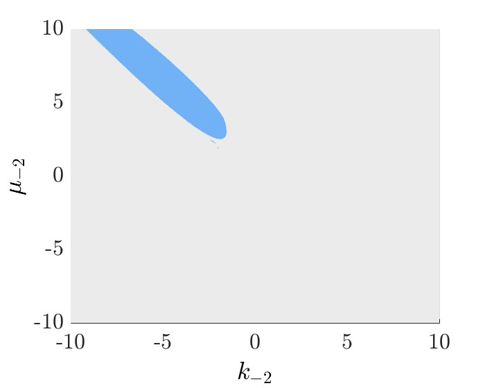

- Vehicle id -1

Example output from Python:             |  Example output from Matlab:
:--------------------------------------:|:-------------------------:
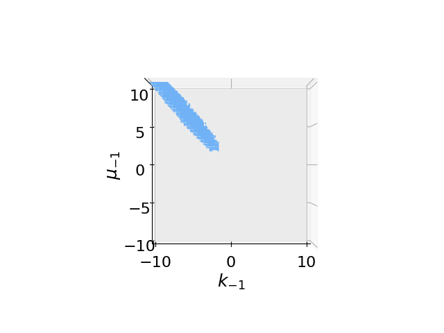|  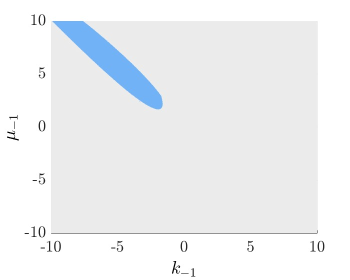

- Vehicle id 1

Example output from Python:             |  Example output from Matlab:
:--------------------------------------:|:-------------------------:
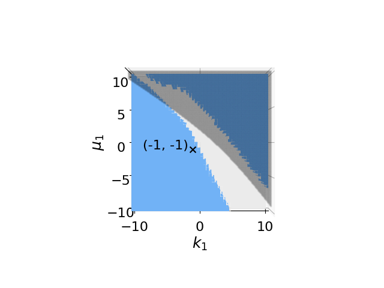|  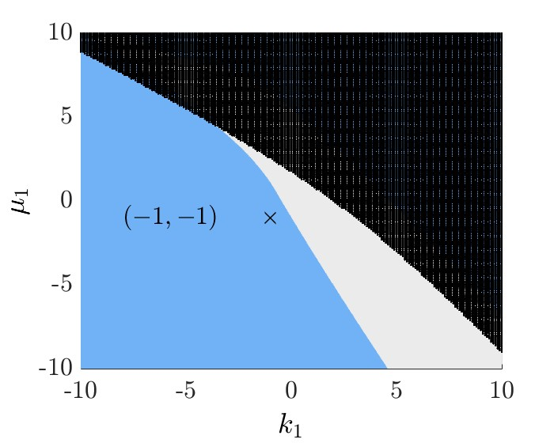

- Vehicle id 2

Example output from Python:             |  Example output from Matlab:
:--------------------------------------:|:-------------------------:
|  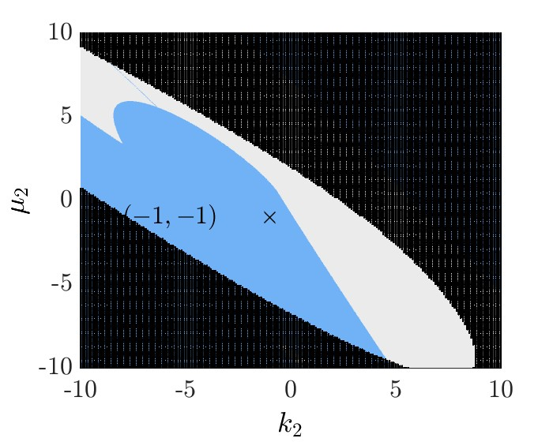

#### TrafficSimulation_PerturbationAhead[.m](https://github.com/soc-ucsd/LCC/blob/main/src/TrafficSimulation_PerturbationAhead.m) / [.py](https://github.com/soc-ucsd/LCC/blob/main/Python%20Implementation/src/TrafficSimulation_PerturbationAhead.py)
This file will generate traffic simulation graph for the following scenario.

Scenario: There are m HDVs ahead of the CAV and n HDVs behind the CAV. There also exists a head vehicle at the very beginning. One slight disturbance happens at the head vehicle

**Default Parameters Setup:**
- n = 2: Number of the following HDVs
- m = 2: Number of the preceding HDVs
- PerturbedID = 0: perturbation on head vehicle 
- PerturbedType = 1: Sine-wave Perturbation

**Output:**

- Case A: incorporate one preceding car 

Example output from Python:             |  Example output from Matlab:
:--------------------------------------:|:-------------------------:
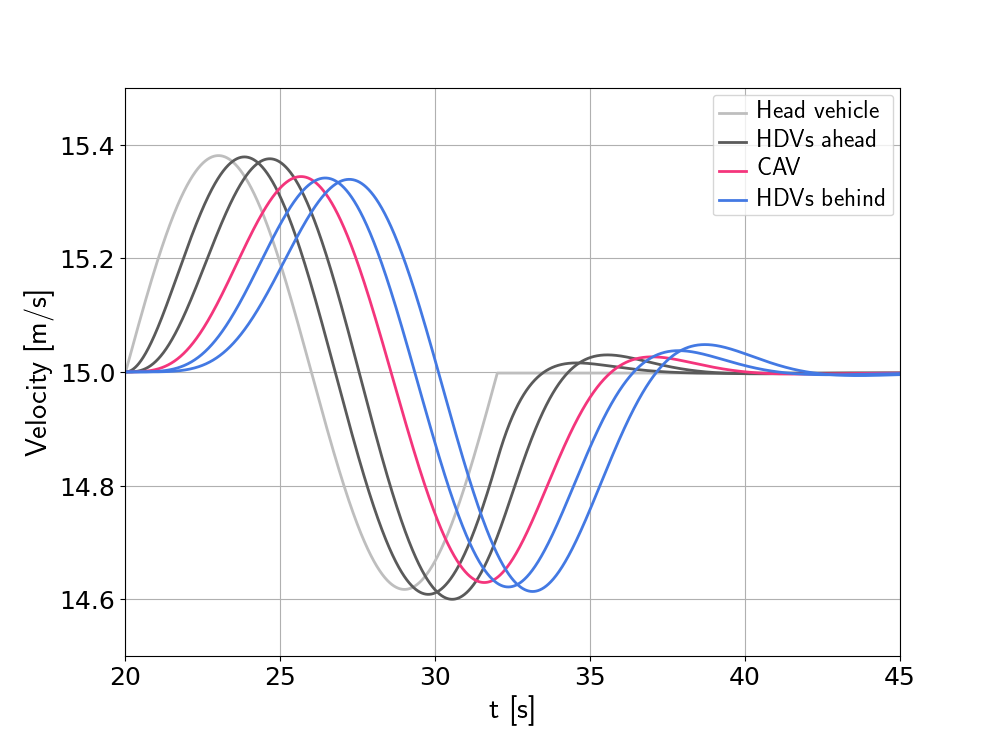|  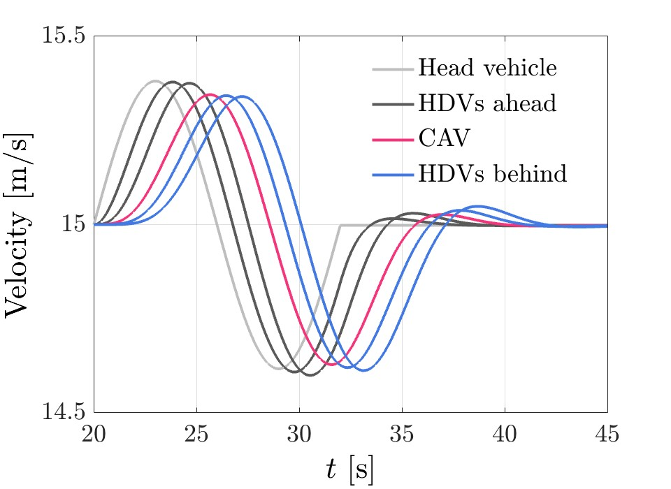

- Case B: incorporate two preceding car 

Example output from Python:             |  Example output from Matlab:
:--------------------------------------:|:-------------------------:
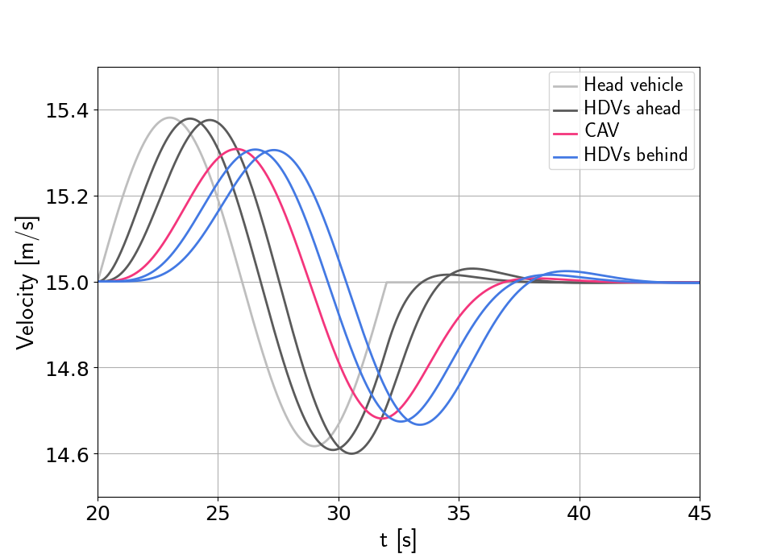|  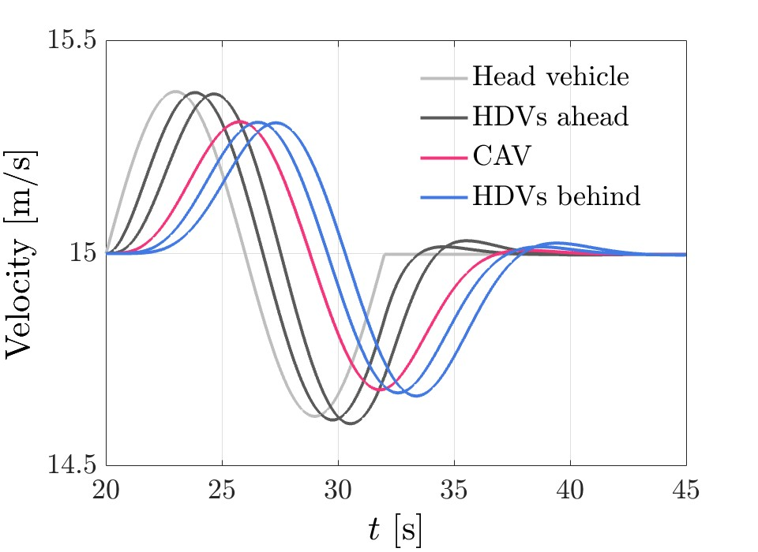

- Case C: incorporate two preceding car and one following car

Example output from Python:             |  Example output from Matlab:
:--------------------------------------:|:-------------------------:
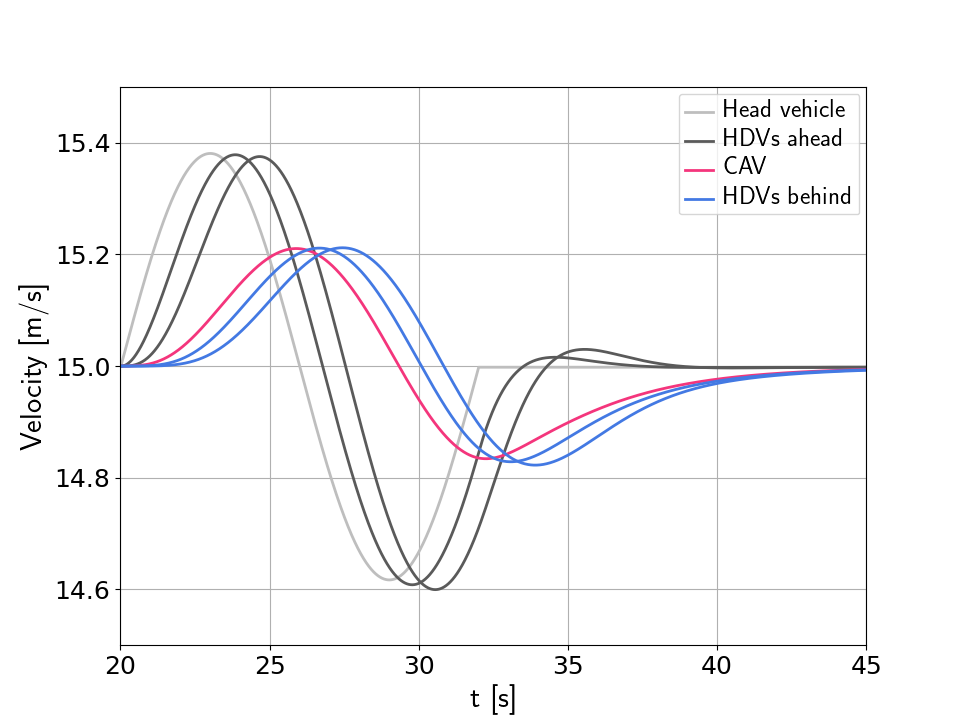|  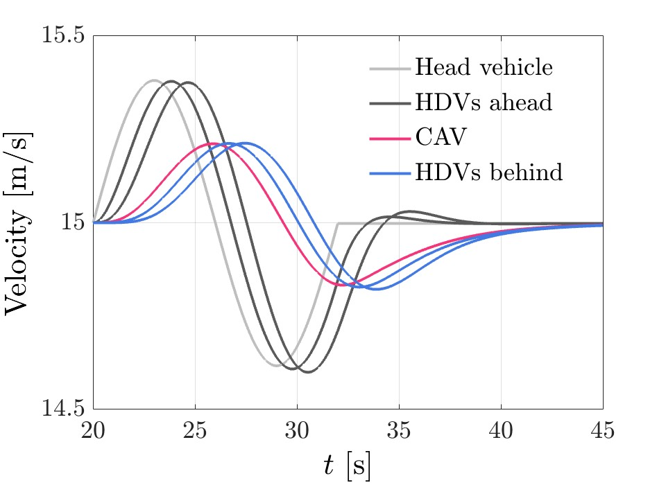

- Case D: incorporate two preceding car and two following car

Example output from Python:             |  Example output from Matlab:
:--------------------------------------:|:-------------------------:
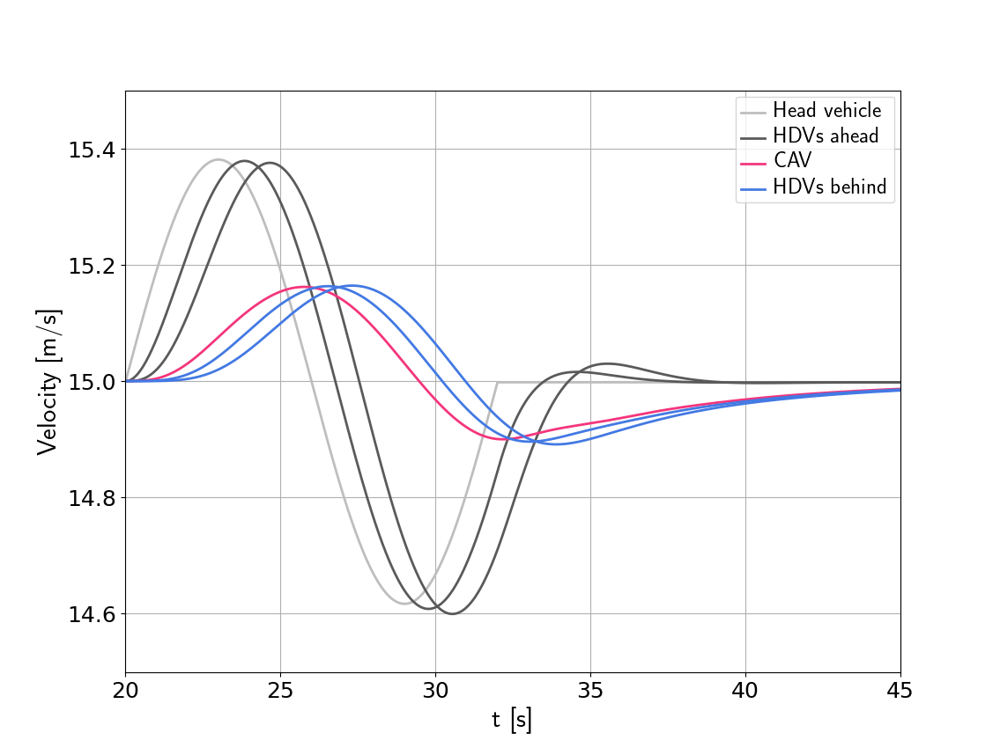|  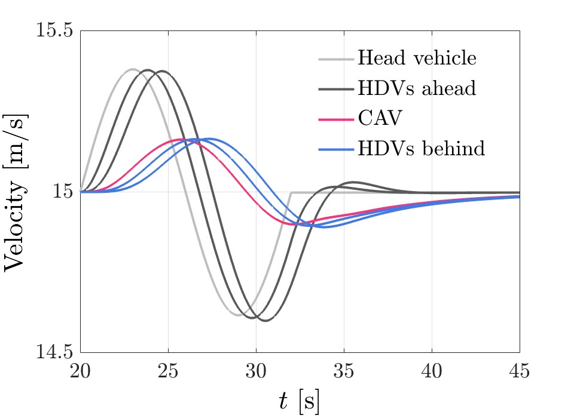

#### FrequencyDomainResponse[.m](https://github.com/soc-ucsd/LCC/blob/main/src/FrequencyDomainResponse.m) / [.py](https://github.com/soc-ucsd/LCC/blob/main/Python%20Implementation/src/FrequencyDomainResponse.py)
This function is used to calculate the magnitude of the head-to-tail transfer function of LCC at various excitation frequencies at different feedback cases.
The definition of the head-to-tail transfer function is mentioned above.
>See Section V.A of the [paper](https://arxiv.org/abs/2012.04313) for details

Example output from Python:             |  Example output from Matlab:
:--------------------------------------:|:-------------------------:
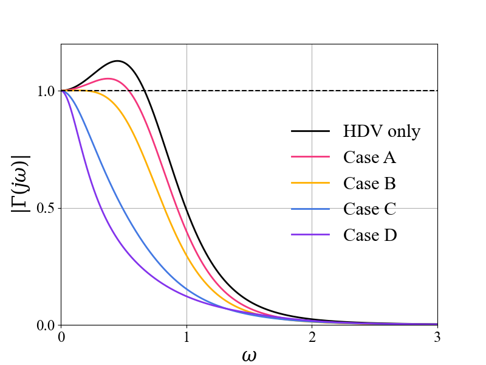|  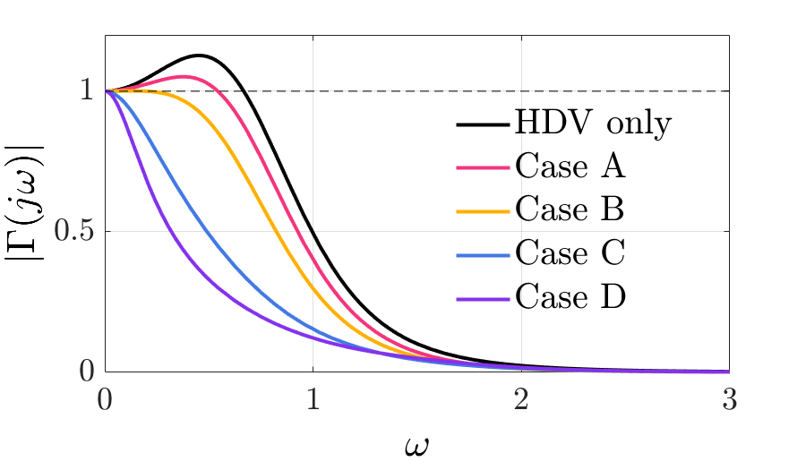

#### NewLookingAheadStringStableRegion_AfterLookingBehind[.m](https://github.com/soc-ucsd/LCC/blob/main/src/NewLookingAheadStringStableRegion_AfterLookingBehind.m) / [.py](https://github.com/soc-ucsd/LCC/blob/main/Python%20Implementation/src/NewLookingAheadStringStableRegion_AfterLookingBehind.py)
This function is used to find the "looking ahead" head-to-tail string stable regions after incorportating the motion of one of vehicle behind (defined by `id_behind` in the code).

Example output from Python:             |  Example output from Matlab:
:--------------------------------------:|:-------------------------:
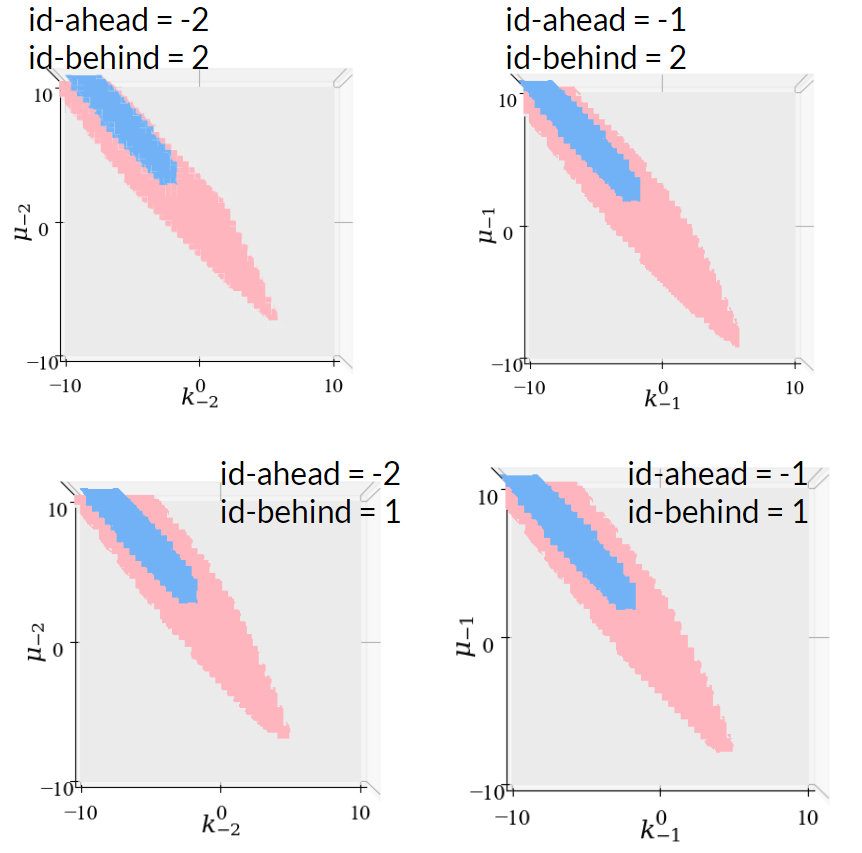|  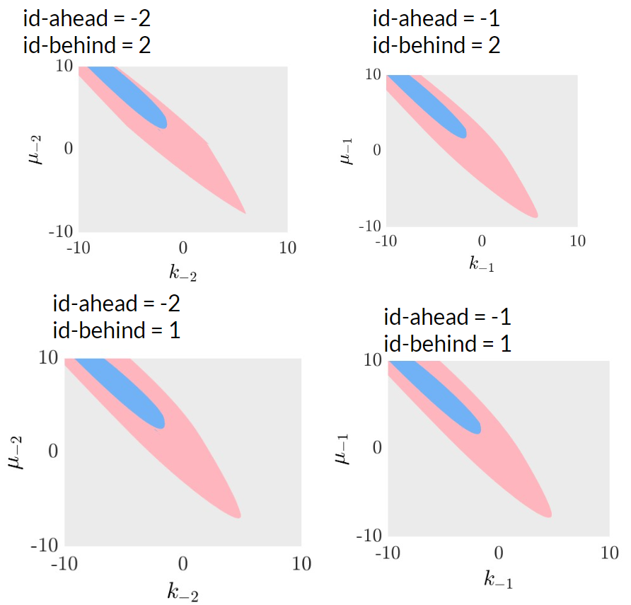

#### OVMSpacingPolicy[.m](https://github.com/soc-ucsd/LCC/blob/main/src/OVMSpacingPolicy.m) / [.py](https://github.com/soc-ucsd/LCC/blob/main/Python%20Implementation/src/OVMSpacingPolicy.py)
This function is used to calculate the three energy-related metrics of the Free-Driving LCC system at different system sizes and time lengths.

Example output from Python:             |  Example output from Matlab:
:--------------------------------------:|:-------------------------:
| 
>See Section II.A of the [paper](https://arxiv.org/abs/2012.04313) for details

#### Plot_NewLookingAheadStringStableRegion_AfterLookingBehind[.m](https://github.com/soc-ucsd/LCC/blob/main/src/Plot_NewLookingAheadStringStableRegion_AfterLookingBehind.m) / [.py](https://github.com/soc-ucsd/LCC/blob/main/Python%20Implementation/src/Plot_NewLookingAheadStringStableRegion_AfterLookingBehind.py)
It serves the same purpose as **NewLookingAheadStringStableRegion_AfterLookingBehind**[.m](https://github.com/soc-ucsd/LCC/blob/main/src/NewLookingAheadStringStableRegion_AfterLookingBehind.m) / [.py](https://github.com/soc-ucsd/LCC/blob/main/Python%20Implementation/src/NewLookingAheadStringStableRegion_AfterLookingBehind.py).

## Python Packages

- math
- numpy
- datetime
- os
- scipy.io
- scipy.optimize
- scipy.linalg
- sys
- line_profiler
- matplotlib
- time
- tqdm
- joblib
- tqdm
- mpl_toolkits.mplot3d
- multiprocessing
- sympy
